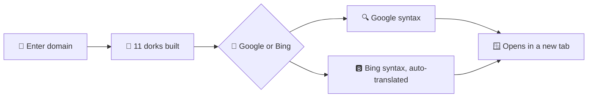

# 🕵️ dorker.sh

**Generate ready-to-click Google & Bing dorks for any target domain.**
A single-file, client-side console for bug bounty hunters and pentesters.

 

<!-- Replace with a screenshot of the tool -->

[How it works](#-how-it-works) · [Features](#-features) · [Usage](#-usage) · [Dork queries](#-dork-queries) · [Google vs Bing](#-google-vs-bing) · [Common problems](#-common-problems) · [Responsible use](#%EF%B8%8F-responsible-use)

---

## 💡 What is it?

Writing the same `site:`, `ext:`, `inurl:` and `intitle:` queries for every new target gets old fast. **dorker.sh** builds them for you.

Type a domain and get a list of ready-made search URLs. Click any line to open that dork in a new tab on Google or Bing.

It only builds search-engine URLs. It doesn't scan, exploit or access anything on its own. Nothing is sent anywhere except the search engine itself.

## ⚙️ How it works

Every dork is written in Google syntax first. When you switch to Bing, the tool translates it for you.

## ✨ Features

| | |
|---|---|
| 📝 **11 ready-made dorks** | Parameters, legacy pages, config and backup files, open-redirect candidates, API docs and more. |
| 🪟 **One click, new tab** | Click a line to open that dork. One query per click keeps usage manual and low-volume. |
| 🔀 **Google / Bing toggle** | Switch tabs and the query syntax is rewritten for the engine you picked. |
| 🔄 **Auto-translation** | `ext:` becomes `filetype:` for Bing, and `\|` chains are rewritten so `site:` stays applied to every clause. |
| 🔤 **Safe URL encoding** | The domain and operators are encoded with `encodeURIComponent`, so special characters don't break the query. |
| 📦 **Zero dependencies** | One HTML file. No build step, no backend, no tracking. |

---

## 🚀 Usage

1. Open `index.html` in any browser
2. Enter a **target domain** in the input field (e.g. `example.com`)
3. Toggle **Google** or **Bing** to switch query syntax
4. Click any line to open that dork in a new tab

> 💡 Use a bare domain like `example.com`. A full URL with `https://` doesn't work as a `site:` value on either engine.

---

## 🔎 Dork queries

| # | Query pattern | What it's trying to find |
|---|---|---|
| 1 | `site:domain inurl:&` | Any indexed page whose URL contains a query string (`?a=1&b=2`). A quick way to see which pages take parameters at all. |
| 2 | `site:domain ext:aspx \| ext:asp \| ext:jsp \| ext:html \| ext:htm` | Legacy or server-rendered pages. Useful for fingerprinting the tech stack, since classic ASP/JSP often signals older, less-maintained infrastructure. |
| 3 | `site:domain ext:log \| ext:txt \| ext:conf \| ext:env \| ext:bak \| ext:git \| ...` | Accidentally indexed **config files, backups, logs and version-control artifacts**. One of the most common sources of leaked secrets. |
| 4 | `site:domain inurl:url= \| inurl:return= \| inurl:next= \| inurl:redir= inurl:http` | Parameters that look like **open-redirect** candidates. |
| 5 | `site:domain inurl:http \| inurl:url= \| inurl:path= \| ... inurl:&` | Broader sweep for any parameter that might carry a URL or file path (SSRF / LFI candidates). |
| 6 | `site:domain inurl:config \| inurl:env \| inurl:backup \| inurl:admin \| inurl:php` | Pages and paths that *sound* administrative or configuration-related. |
| 7 | `site:domain inurl:email= \| inurl:phone= \| inurl:password= \| inurl:secret= inurl:&` | Parameters that may leak **PII or credentials** directly in the URL. |
| 8 | `site:domain inurl:apidocs \| inurl:swagger \| inurl:api-explorer` | Exposed **API documentation**. Swagger/OpenAPI UIs are often left public and reveal the whole API surface. |
| 9 | `site:domain inurl:cmd \| inurl:exec= \| inurl:query= \| inurl:run= \| ... inurl:&` | Parameters that resemble **command or query execution** endpoints (potential RCE/SQLi surface). |
| 10 | `site:domain inurl:(unsubscribe\|register\|feedback\|signup\|...)` | Generic user-facing functionality pages. Useful for mapping the app's feature set. |
| 11 | `site:domain intitle:"Welcome to Nginx"` | Default, unconfigured **Nginx welcome pages**. A sign of a forgotten or misconfigured host. |

None of these queries do anything beyond asking Google or Bing what they've already indexed that matches the pattern. They only surface what the search engine has crawled and cached publicly.

---

## 🔀 Google vs Bing

The two engines are not interchangeable, which is why the tool translates every dork for you.

| | Google | Bing |
|---|---|---|
| **File-type operator** | `ext:` | No `ext:` support. It must be `filetype:`, and the tool rewrites it automatically. |
| **OR logic** | A bare pipe `\|` works and stays scoped inside the query. | Bing does **not** reliably scope `site:` across an un-parenthesized `\|` chain. Everything after the first `\|` can be treated as a separate, unscoped query and silently leak results from unrelated domains. The tool pulls `site:` out front and rewrites the rest as `site:domain (a OR b OR c)`. |
| **`site:` value** | Bare domain only (`example.com`), never a full URL with `https://`. | Same rule. |

> 💡 If you hand-edit a query outside this tool, keep these differences in mind. Pasting a Google-style dork straight into Bing (or the other way around) is the most common reason a dork returns nothing when results clearly exist.

---

## 🧯 Common problems

- **Empty results don't mean nothing exists.** Zero hits only means the engine hasn't indexed a matching page. Search engines skip pages blocked by `robots.txt`, pages that need auth, and anything behind `noindex`.
- **Stale index.** A file might have been indexed months ago and removed since. Verify a hit is still live before treating it as a finding.
- **CAPTCHAs and rate limiting.** Firing many dorks quickly, especially with automated tooling, triggers Google's "unusual traffic" wall or Bing's throttling. This tool opens one query per click, in a new tab, to keep usage manual.
- **Operator limits.** Google silently drops or ignores extra operators once a query gets too long or complex. If a dork with many `\|` chains doesn't seem to filter, split it into smaller queries.
- **`site:` scoping on Bing.** An unparenthesized `\|` chain can leak unrelated domains. Double-check that `site:` is still applied to every clause.
- **False positives.** Broad dorks like `inurl:admin` or `inurl:backup` match plenty of harmless pages, such as marketing copy or blog posts. Treat hits as leads to verify manually, not confirmed issues.
- **URL encoding.** Spaces, quotes and `&` in the domain or in hand-added operators must be encoded or the query breaks. The tool handles this, but be careful when copying a raw query elsewhere.
- **Operator support drifts.** Google and Bing periodically deprecate or restrict operators (Google has scaled back `inurl:` and `intext:` reliability at various points). If a dork that used to work stops returning anything, check that the operator is still supported before assuming the target has no exposure.

---

## 🔒 Privacy

- No backend, no tracking, no data collection
- Nothing is sent anywhere except the search engine you choose to open
- The only extra request is the Google Fonts import

---

## ⚖️ Responsible use

This tool only builds search-engine URLs. Still, running these queries against a domain you don't own, or don't have explicit permission to test, can violate that organization's terms of service or local law.

Only recon targets that are **in scope** for a program you're participating in, or that you have permission to test, such as a bug bounty scope or a pentest authorization.

## 🙏 Credits

Dork patterns adapted from public dorking references, including [taksec/google-dorks-bug-bounty](https://taksec.github.io/google-dorks-bug-bounty/).

Built for hunters who let the search engine do the crawling. 🕵️

